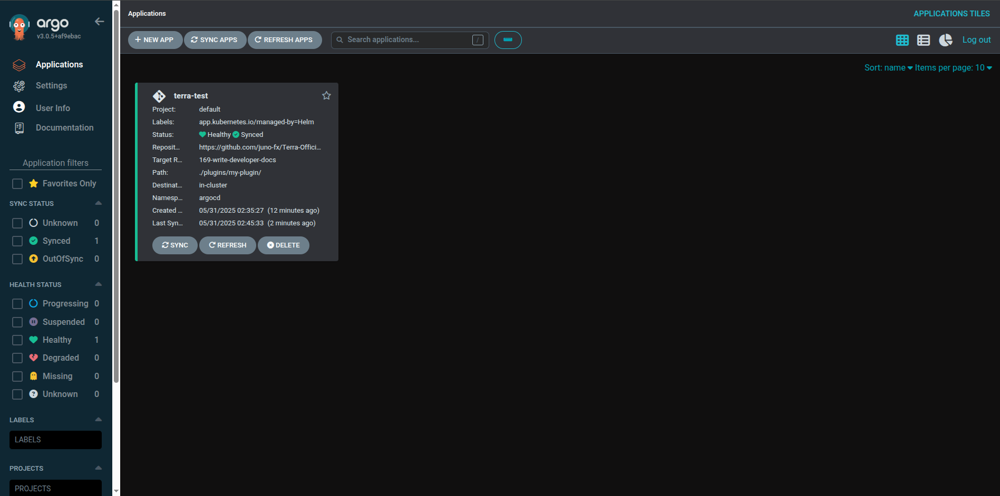
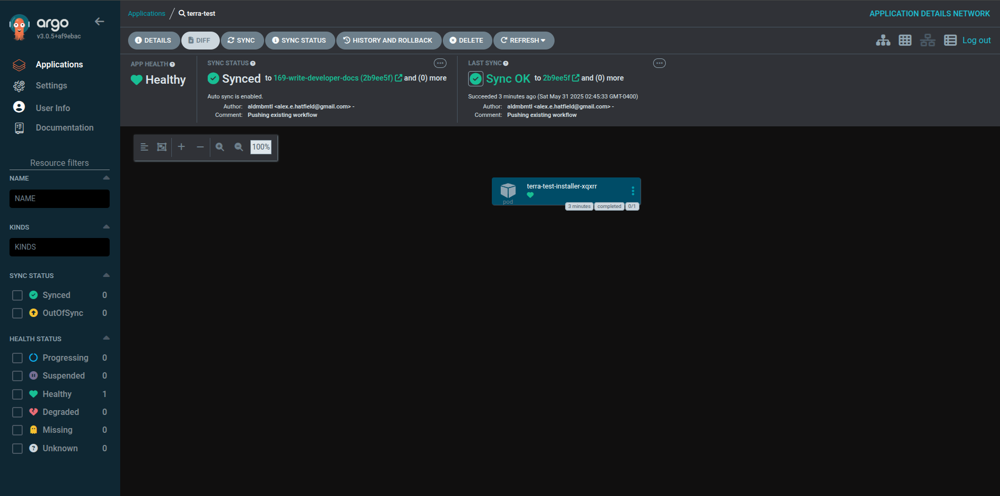

# Workflow

## Deployment Development

The development workflow is designed to focus on the raw Helm Chart development and then simulate the deployment
via a local Kubernetes cluster installed with ArgoCD. This allows developers to iterate quickly on their plugins
locally without needing to deploy to a production environment until they are ready. The workflow is as follows:

1. Activate the Devbox environment.
2. Create the plugin locally and push it to a remote branch.
3. Launch a local Kind Cluster pre-installed with ArgoCD.
4. Install the ArgoCD Application Resource that points to your plugin on your remote branch.
5. Log in to the ArgoCD UI and see your plugin listed as an Application.
6. Make changes to your plugin locally and push them to the remote branch.
7. ArgoCD will automatically detect the changes and update the application in the local cluster.
8. If you are running a more complex Plugin that uses the `/scripts` directory, make sure to run `make package <plugin name>` to package your plugin before pushing changes. This will ensure that the scripts are included in the Helm Chart.
9. Repeat the process until you are satisfied with your plugin.

## Workflow Steps

1. **Activate Devbox Environment**: Terra uses Devbox to manage the development environment. Activate the Devbox shell to ensure all dependencies are available.

    <!-- termynal -->

    ```shell
    $ devbox shell
    ```

2. **Create a Plugin**: Use the `make new-plugin <plugin name>` command to create a new plugin scaffolding.

    <!-- termynal -->

    ```shell
    $ make new-plugin my-plugin
    ```

3. **Push to Remote Branch**: Commit your changes and push them to a remote branch.
4. **Launch Local Cluster**: Use `make test <plugin name>` to start a local Kind cluster with ArgoCD pre-installed.

    <!-- termynal -->

    ```shell
    $ make test my-plugin
    ...
    >> ArgoCD UI Listening <<
    http://localhost:8080
   
    >> ArgoCD Admin Credentials <<
    admin
    336LYpUVgfDeFUKb
    ```

5. **Access ArgoCD UI**: Open the ArgoCD UI in your browser at `http://localhost:8080` and log in with the provided credentials.

    

    !!! danger "ArgoCD Sync Failure"
        If you encounter a sync failure that states something about "failed to dial", this is likely due to
        a race condition where the ArgoCD server is not fully up and running before the sync is attempted. Open the
        cluster and restart the ArgoCD server.

    !!! danger "ArgoCD Sync Failure"
        If your plugin says "path not found", you need to push your changes to the remote branch before running the
        `make test` command. ArgoCD needs to see the latest changes in the remote branch to sync correctly.

6. **Make Changes**: Make changes to your plugin locally and push them to the remote branch.

7. **Automatic Sync**: ArgoCD will automatically detect the changes and update the application in the local cluster.

    

    !!! info "Force Refresh"
        ArgoCD will automatically refresh the application every 3 minutes. If you want to force a refresh, you can click the "Refresh" button in the ArgoCD UI.

8. **Verify Changes**: You can verify the changes by checking the logs of the application or by accessing the application in the local cluster. Any files being installed can also be viewed in the created `.apps/installs/<plugin-name>` directory within your IDE's project file structure

9. **Repeat**: Continue making changes and pushing them to the remote branch. ArgoCD will keep your local cluster in sync with the latest changes.

10. **Clean Up**: When you are done testing, you can clean up the local cluster by running:

    <!-- termynal -->

    ```shell
    $ make down
    ```
## Terra Integration Testing

Once your plugin is tested and ready, you can integrate it into Terra by adding it to a Terra repository. 
Follow the instructions in the [Terra Repositories](./repositories.md) documentation to add your plugin to a 
repository and make it available for installation through the Terra UI. Once there, you can perform further 
testing within the Terra environment to ensure compatibility and functionality. You can do this with the 
following steps:

1. **Clone the Bootstrap Repository**: Start by cloning the Juno Bootstrap repository, which contains the necessary configurations to launch the community version of Orion.

    <!-- termynal -->

    ```shell
    $ git clone https://github.com/juno-fx/Juno-Bootstrap.git
    $ cd Juno-Bootstrap
    ```
   
2. **Start the Devbox Environment**: Activate the Devbox shell to ensure all dependencies are available.

    <!-- termynal -->

    ```shell
    $ devbox shell
    ```

3. **Launch Orion**: Use the provided Makefile to launch Orion with the community configuration.

    <!-- termynal -->

    ```shell
    $ make bootstrap
    ```
   
4. **Login to Orion**: Open your web browser and navigate to `https://localhost`. Log in using the default credentials:

    - Email: `test@email.com`
    - Password: `juno`

5. **Add Your Plugin Repository**: In the Orion UI, navigate to the Terra section and add your plugin repository as a new source. This will allow you to access and install your plugin within Terra.

6. **Install Your Plugin**: Once the repository is added, locate your plugin in the Terra UI and proceed to install it. Follow any prompts to complete the installation process.

7. **Iterate as Needed**: If you need to make changes to your plugin, repeat the development workflow steps to update and test your plugin locally. After making changes, push them to the remote branch, and then refresh the Terra UI to see the updates.

8. **Clean Up**: When you are finished testing, you can stop the Orion instance by running:

    <!-- termynal -->

    ```shell
    $ make down
    ```