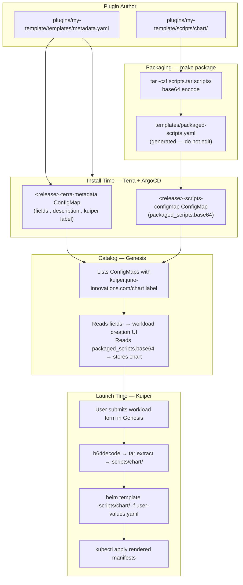

# Overview

Workload templates are the most complex plugin type. This page covers the complete system — what they are,
how the data flows from plugin through the platform to a running workload, and how to author them correctly.

---

## What Is a Workload Template?

A workload template is a plugin that defines a **reusable workload schema** for the Juno platform.

- **At install time:** Terra installs it as an ArgoCD Application into the `argocd` namespace. No running
  workload is created. What gets created is a pair of ConfigMaps.
- **At launch time:** A user opens Genesis, picks a workload type, fills in parameters, and submits.
  Kuiper reads the stored schema, renders the embedded Helm chart with the user's values, and applies
  the resulting manifests to the cluster.

The key insight: **the plugin ships a Helm chart inside a ConfigMap**. Genesis reads the schema from it.
Kuiper renders it on demand.

---

## Full Data Flow



---

## Directory Structure

```
scripts/
├── entrypoint.sh              # Required for packaging; not executed at launch
└── chart/
    ├── Chart.yaml
    ├── values.yaml            # All field names from metadata.yaml must exist here
    └── templates/
        ├── workstation.yaml   # Primary workload resource (StatefulSet by convention; Crossplane plugins use xr.yaml)
        ├── service.yaml       # ClusterIP Service
        └── ingress.yaml       # nginx Ingress with Hubble auth
```

---

## `templates/metadata.yaml`

This ConfigMap does two jobs:

**1. Discovery** the `kuiper.juno-innovations.com/chart` label tells Genesis to include this plugin
in the workload catalog.

**2. Schema** the `data.fields:` block defines what the user sees in the Genesis workload creation form.
Every field becomes a Helm value passed to `scripts/chart/` by Kuiper.

```yaml linenums="1" title="templates/metadata.yaml"
apiVersion: v1
kind: ConfigMap
metadata:
  name: "{{ .Release.Name }}-terra-metadata"
  labels:
    # REQUIRED: triggers Genesis catalog discovery.
    # Value MUST point to this plugin's scripts ConfigMap.
    kuiper.juno-innovations.com/chart: "{{ .Release.Name }}-scripts-configmap"
  annotations:
    # REQUIRED: workload category in Genesis catalog and Hubble running workload display.
    # Value can be any string.
    #   - This copy (metadata.yaml) is read by Genesis to categorize the template in the catalog.
    #   - A matching copy on the StatefulSet in scripts/chart/templates/ is read by Hubble.
    juno-innovations.com/workload: "Application"
data:
  # REQUIRED: must exactly match the label value above.
  chart: "{{ .Release.Name }}-scripts-configmap"
  # Optional: shown in the Genesis catalog.
  description: "My workload description"
  # REQUIRED: schema for the Genesis workload creation form.
  # Every name: here must exist as a key in scripts/chart/values.yaml.
  fields: |
    - name: icon
      default: "https://example.com/icon.png"
    - name: registry
      description: "Container registry"
      type: string
      required: true
      default: "docker.io"
    - name: repo
      description: "Image repository"
      type: string
      required: true
    - name: tag
      description: "Image tag"
      type: string
      required: true
      default: "latest"
    - name: gpu
      description: "Attach a GPU"
      type: boolean
      required: true
```

### `juno-innovations.com/workload` Annotation Values

The values in the table below are the conventional categories used in the Juno platform, but **this
annotation accepts any string**. The value in `metadata.yaml` is read by Genesis to categorize the
template in the workload catalog. The matching value in `scripts/chart/templates/` is read by Hubble
to label the active running workload.

| Value             | Conventional use                 |
|-------------------|----------------------------------|
| `Application`     | General GUI applications         |
| `Terminal`        | Shell / terminal workloads       |
| `Workspace`       | Full desktop or IDE environments |
| `Server`          | Headless server workloads        |
| `Virtual Machine` | KubeVirt VM workloads            |

These are examples — not an exhaustive list. Custom values are valid.

!!! warning "Set this annotation in two places"
    The `juno-innovations.com/workload` annotation must appear in both:

    1. `templates/metadata.yaml` — Genesis uses it to categorize the template in the catalog
    2. `scripts/chart/templates/workstation.yaml` on the StatefulSet — Hubble uses it to display
       the running workload type

---

## `scripts/chart/values.yaml`

Every field `name:` in `metadata.yaml` must exist as a key in `scripts/chart/values.yaml`.
Kuiper passes user-provided values to Helm as `--set key=value`. If a key is missing from `values.yaml`,
Helm rendering fails silently at workload launch time.

```yaml linenums="1" title="scripts/chart/values.yaml"
# Kuiper-injected standard values — do not remove these
name: my-template
user:
group:
cpu: "1"
memory: "1Gi"
cpuLimit: null
memoryLimit: null
idx: 0
guid: 0
puid: 0
host:
pullSecret:
session:
volumeMounts: []
volumes: []
env:
  - name: JUNO
    value: "true"
selector:
plugins: []
_kuiper:

# User-facing fields from metadata.yaml — must all be present
registry: docker.io
repo: my-image
tag: latest
gpu: false
```

### Kuiper-Injected Standard Values Reference

| Key                        | Description                                                                                                                                                                                                              |
|----------------------------|--------------------------------------------------------------------------------------------------------------------------------------------------------------------------------------------------------------------------|
| `name`                     | Unique name for this workload instance                                                                                                                                                                                   |
| `user`                     | Username of the Juno user who launched the workload                                                                                                                                                                      |
| `group`                    | Primary group of that user                                                                                                                                                                                               |
| `cpu` / `memory`           | Resource requests from the Genesis launch form                                                                                                                                                                           |
| `cpuLimit` / `memoryLimit` | Resource limits; `null` means no limit applied                                                                                                                                                                           |
| `idx`                      | Instance index for multi-instance workloads                                                                                                                                                                              |
| `guid` / `puid`            | Group ID / user ID of the launching user                                                                                                                                                                                 |
| `host`                     | Hostname assigned to this workload at launch time — the same hostname registered with Hubble. Use this to construct the ingress `host:` rule and to pass the base URL into the container (e.g. via the `PREFIX` env var) |
| `session`                  | Unique session token for this workload instance                                                                                                                                                                          |
| `pullSecret`               | Image pull secret name if configured in the cluster                                                                                                                                                                      |
| `volumeMounts` / `volumes` | PVC mounts requested at launch time                                                                                                                                                                                      |
| `env`                      | User-defined environment variables from the Genesis launch form                                                                                                                                                          |
| `selector`                 | Label selector injected by Kuiper for resource ownership tracking                                                                                                                                                        |
| `plugins`                  | Helios plugin script mounts                                                                                                                                                                                              |
| `_kuiper`                  | **Deprecated.** Internal Kuiper metadata — do not read or modify. May be removed in a future platform version.                                                                                                           |

!!! warning "Ingress must not use the root path"
    Juno platform services are served from `/` on the cluster ingress. A workload template must
    **not** configure its ingress at the root path — doing so will clash with platform services and
    break routing for the entire cluster.

    Your workload must support a URL prefix (e.g. `/{{ .Values.name }}/`) or another sub-path
    routing strategy. The `PREFIX` environment variable is the conventional way to pass the base
    path into the container — set it from `{{ .Values.host }}` or your chosen sub-path in
    `workstation.yaml`.

---

## `scripts/chart/templates/workstation.yaml`

This StatefulSet is what Kuiper deploys when a user launches a workload. Key conventions:

- **Node affinity** — must target nodes with `juno-innovations.com/workstation: "true"`
- **Toleration** — must tolerate the `juno-innovations.com/workstation: NoSchedule` taint
- **Annotations** — `juno-innovations.com/workload` must match `metadata.yaml`
- **Plugin mounts** — range over `.Values.plugins` to mount Helios plugin scripts
- **Standard env vars** — `JUNO_WORKSTATION`, `JUNO_PROJECT`, `USER`, `HOME`, `PREFIX`

See `plugins/helios/scripts/chart/templates/workstation.yaml` for the full reference implementation.

---

## Packaging

The entire `scripts/` directory (including `scripts/chart/`) must be packaged into a ConfigMap before
deploying. This is done by:

```bash
make package <plugin-name>
```

What it does:

```
scripts/  →  tar -czf scripts.tar  →  base64  →  injected into templates/packaged-scripts.yaml
```

!!! danger "Always repackage after any scripts/ change"
    `templates/packaged-scripts.yaml` is a **generated file**. Editing `scripts/` without repackaging
    means the old version deploys. ArgoCD gives no error. This is the most common source of bugs.

### The 1MiB Limit

Kubernetes enforces a 1MiB limit on ConfigMap data. The base64-encoded tarball must fit within this.
`make package` calls `make check-size` automatically:

- **> 900KB** — warning printed
- **> 1MiB** — error, build blocked

If approaching the limit:

- Remove unnecessary assets from `scripts/assets/`
- Remove unused templates from `scripts/chart/templates/`
- Avoid adding binaries or large static files to `scripts/`

### Development Workflow

For active workload template development, use watch mode to auto-repackage on every save:

```bash
make watch <plugin-name>
```

This requires `inotifywait` (available in the devbox shell).

---

## Creating a Workload Template

1. `make new-plugin` → select type `3` (workload) → select workload category
2. Edit `terra.yaml` — set `name`, `description`, `category`, `icon`
3. Edit `templates/metadata.yaml`:
   - Set `description:`
   - Define `fields:` schema with all user-facing parameters
   - Verify `juno-innovations.com/workload` annotation matches intended category
4. Edit `scripts/chart/values.yaml` — add every field from `metadata.yaml` as a key
5. Edit `scripts/chart/templates/workstation.yaml`:
   - Set correct image reference using `{{ .Values.registry }}/{{ .Values.repo }}:{{ .Values.tag }}`
   - Set correct `containerPort` and probe ports
   - Set `juno-innovations.com/workload` annotation to match `metadata.yaml`
6. Edit `scripts/chart/templates/service.yaml` — set correct `port`/`targetPort`
7. `make package <plugin-name>`
8. `make check-size <plugin-name>` — confirm under 1MiB
9. `make verify` — confirm nothing is stale
10. `make test <plugin-name>` or `make test-plugin <plugin-name>`
11. Commit `scripts/`, `templates/metadata.yaml`, AND the generated `templates/packaged-scripts*.yaml`

---

## Common Mistakes

| Mistake                                            | Symptom                                    | Fix                                                |
|----------------------------------------------------|--------------------------------------------|----------------------------------------------------|
| `fields:` name ≠ `values.yaml` key                 | Workload fails at launch; no visible error | Align names exactly                                |
| Forgot `make package`                              | Old workload behavior after deploy         | `make package <plugin>`                            |
| Missing `kuiper.juno.../chart` label               | Plugin absent from Genesis catalog         | Add label to `metadata.yaml`                       |
| Missing `juno-innovations.com/workload` annotation | Not categorized in Hubble                  | Add to both `metadata.yaml` and `workstation.yaml` |
| `packaged-scripts.yaml` hand-edited                | Overwritten on next `make package`         | Edit `scripts/` instead                            |
| Large assets in `scripts/`                         | Exceeds 1MiB ConfigMap limit               | Use `make check-size`, trim assets                 |

---

## Next Steps

- [Configuration Reference](workload-configuration.md) — field types, Kuiper annotations, ingress authentication
- [Guides](workload-guides.md) — full annotated examples: simple web app, EC2-backed workstation

